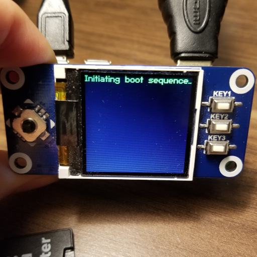

# Expected Result:

This example uses a custom font format that I created for use with my Waveshare 1.44inch TFT LCD Screen, which can be found [here](https://www.waveshare.com/1.44inch-lcd-hat.htm)

The screen has a low transfer rate as it uses SPI, but it has a very high update rate once the data actually gets to the screen.
Another of it's quirks is that it only allows data to be drawn in rectangles, opposed to point by point.
PCF and PSF, or most other raster font formats would work fine, but they don't have kerning support.
Putting this all together it made sense to make a new font format that I could use for my virtual pet.

The Root directory is meant to be copied over the SD card, and the Editor directory is a love2d application that I made to
design custom fonts. Run love2d with those files to run it if you want to create your own font.
